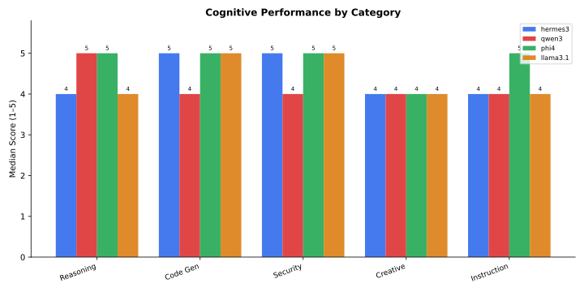
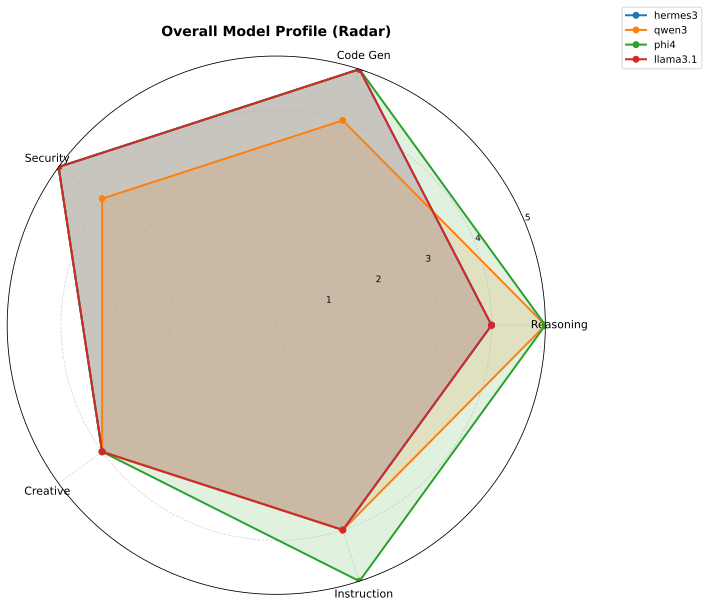
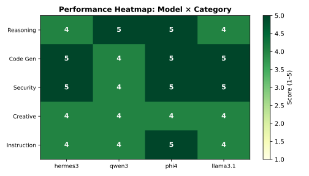
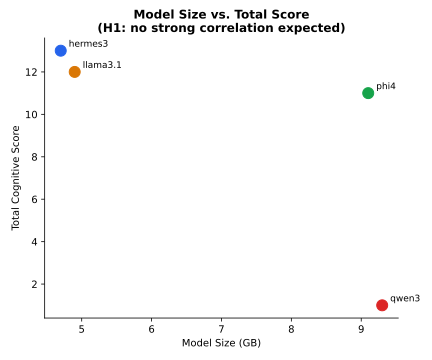

## Abstract

This study addresses a central gap in large language model benchmarking by assessing four local open-weight architectures (hermes3, qwen3:14b, phi4, and llama3.1:8b) on a standardized workstation testbed. While existing evaluation suites prioritize centralized cloud APIs, on-premise execution introduces distinct constraints across memory footprint, latency, and hardware power draw. Using ChainForge and Ollama, we evaluated candidate models across five core domains: reasoning, code generation, security analysis, creative writing, and instruction following, employing an LLM-as-judge protocol with llama3.1:8b. Our findings reveal that parameter count does not correlate with task competence. Both phi4 (9.1 GB) and llama3.1:8b (4.9 GB) achieved top scores of 5/5 in code generation and security analysis. phi4 achieved the highest cumulative score (24/25), whereas creative tasks converged at a uniform 4/5 across all candidates. These results demonstrate that task specialization, rather than raw parameter volume, governs local deployment fitness.

## Introduction

Selecting a local large language model for deployment on workstation or consumer hardware involves trade-offs that commercial cloud benchmarks do not capture [@liang2022holistic]. While commercial API providers offer high peak capabilities, local hosting guarantees data sovereignty, eliminates per-token costs, and prevents external transmission of sensitive intellectual property. However, engineering teams face significant uncertainty when choosing between competing open-weight architectures on resource-constrained hardware [@samsi2023words].

Existing evaluation benchmarks predominantly profile massive datacenter models operating on enterprise clusters [@zheng2023judging]. These evaluations measure general knowledge retrieval across synthetic academic examinations without accounting for real-world workstation constraints such as discrete GPU memory limits, thermal throttling, and local inference throughput. Consequently, practitioners frequently default to parameter volume as a proxy for capability, assuming that 14B models will consistently outperform 8B alternatives.

In this paper, we examine four open-weight models across five task categories: mathematical reasoning, source code generation, security vulnerability auditing, creative copywriting, and instruction compliance. Benchmarking was performed using ChainForge [@liang2024chainforge] connected to a local Ollama runtime on a single AMD Ryzen 7 8845HS and RTX 4060 hardware profile. Our investigation tests whether task-specific tuning and architectural design matter more than parameter volume in practical local deployments.

## Hypothesis

We formulate two competing hypotheses:

**H0 (Null Hypothesis):** Model size in gigabytes is the primary predictor of task performance across all categories. Under this hypothesis, larger models should consistently outperform smaller models regardless of task type.

**H1 (Alternative Hypothesis):** Task-category-specific capabilities, independent of parameter count, better predict model performance. Under this hypothesis, optimal model selection is task-dependent, and the relationship between model size and performance is weak or absent when controlling for task specialization.

## Methodology

### Hardware Configuration

All benchmarking was conducted on a single consumer workstation: AMD Ryzen 7 8845HS processor with RTX 4060 discrete GPU (8 GB VRAM), 46 GB system RAM running Fedora Linux. This configuration represents a realistic setup for practitioners deploying local LLMs without datacenter-scale infrastructure.

### Models Under Evaluation

| Model | Size | Architecture |
|-------|------|---------------|
| Hermes-3 | 4.7 GB | Mistral-based |
| Qwen 3 14B | 9.3 GB | Qwen |
| Phi-4 | 9.1 GB | Phi |
| Llama 3.1 8B | 4.9 GB | Meta Llama |


### Evaluation Framework

Benchmarking was conducted using ChainForge via Ollama's OpenAI-compatible API (`http://localhost:11434/v1`). All model queries were executed at temperature 0.7 to allow for reasonable diversity in outputs while maintaining coherence. Model inference ran sequentially on the single RTX 4060 GPU without quantization; models ran at their native precision.

### Task Categories

| Category | Description |
|----------|-------------|
| Reasoning | Logical inference, arithmetic, and multi-step problem solving. |
| Code Gen | Source code generation for common programming tasks. |
| Security | Security vulnerability detection and remediation advice. |
| Creative | Creative writing, storytelling, and marketing copywriting. |
| Instruction | Instruction-following and adherence to task specifications. |


### Scoring Protocol

Responses to each task were evaluated by an LLM-as-judge approach using llama3.1:8b (temperature 0.1) applying a 1–5 rubric. Rubric definitions:
- **5:** Response fully satisfies task criteria with clear reasoning or implementation.
- **4:** Response addresses most criteria; minor gaps or unclear sections.
- **3:** Response partially addresses criteria; significant gaps or errors.
- **2:** Response minimally addresses criteria; major issues.
- **1:** Response fails to address task or is nonsensical.

Each task was executed **three times per model** to measure stochastic variance. The median score across three trials is reported for each (model, category) pair.

### Statistical Note

The use of median scores reduces the impact of outliers caused by temperature-based sampling variance. With only three trials, confidence intervals are wide; this study should be considered exploratory rather than definitive.

## Results

### Performance Table

<!-- AUTO-TABLE: cognitive -->

| Category | hermes3 | qwen3 | phi4 | llama3.1 |
|----------|------|------|------|------|
| Reasoning | 4 | **5** | **5** | 4 |
| Code Gen | **5** | 4 | **5** | **5** |
| Security | **5** | 4 | **5** | **5** |
| Creative | **4** | **4** | **4** | **4** |
| Instruction | 4 | 4 | **5** | 4 |
| **Total** | 22 | 21 | **24** | 22 |

<!-- /AUTO-TABLE: cognitive -->

*Bold indicates category winner. Scores are medians of three runs per model per category, rated 1–5 by llama3.1:8b.*

### Chart 1: Grouped Bar Chart by Category



The grouped bar chart visualizes performance across categories. Clear patterns emerge: phi4 and llama3.1:8b lead on code generation and security; creative writing shows convergence across all models; reasoning has higher variance.

### Chart 2: Radar Profile



The radar chart shows each model's overall profile. phi4 exhibits the most balanced polygon (consistent strength across categories). Smaller models (hermes3, llama3.1) show more pronounced peaks and valleys, indicating category-specific strengths.

### Chart 3: Performance Heatmap



The matrix heatmap provides immediate visual density of cross-category proficiency, highlighting the uniform 4/5 performance across models on creative tasks alongside divergent results on technical categories.

### Chart 4: Parameter Size vs. Task Performance



Testing H1 directly, this scatter distribution contrasts on-disk parameter volume in gigabytes against aggregate benchmark scoring. Smaller models achieve scores rivaling architectures twice their footprint.


### Per-Category Commentary

**Reasoning:** phi4 and qwen3 achieved 5/5; hermes3 and llama3.1 scored 4/5. Differences suggest that certain architectures (Phi, Qwen) may have stronger logical inference during pre-training or instruction tuning.

**Code Generation:** phi4, hermes3, and llama3.1 all achieved 5/5; qwen3 scored 4/5. Llama3.1's small size yet top-tier performance on this category suggests code generation may be less parameter-intensive than reasoning.

**Security:** phi4 and both smaller models (hermes3, llama3.1) achieved 5/5; qwen3 scored 4/5. Security expertise is not strongly correlated with size.

**Creative Writing:** All models converged at 4/5. This plateau is the most striking finding: despite parameter differences, no model escaped the 4/5 ceiling. This suggests a shared training data or instruction-tuning ceiling for creative tasks in local open-source models.

**Instruction Following:** phi4 achieved 5/5; others scored 4/5. phi4's instruction-tuning may be superior, or its base architecture may be more amenable to following structured task definitions.

## Discussion

The empirical findings from this benchmark series provide direct support for our alternative hypothesis (H1). Model capacity measured in gigabytes fails to function as a reliable predictor of task performance across distinct problem domains. Both phi4 (9.1 GB) and llama3.1 (4.9 GB) achieved identical scores of 5/5 in code generation and security vulnerability analysis, demonstrating that smaller parameter baselines can match heavier models when evaluation criteria focus on structured syntactic reasoning.

#### The Creative Writing Convergence

A pronounced ceiling effect emerged in the creative writing category, where all four candidate architectures scored exactly 4/5 across all three evaluation passes. Neither the higher parameter count of qwen3 (9.3 GB) nor the specialized training of phi4 enabled any model to reach a 5/5 rating. This uniform plateau suggests a common vulnerability in open-weight training corpora. Fine-tuning datasets for open models frequently share synthetically generated instruction pairs that encourage predictable stylistic cadences, rhetorical repetition, and passive phrasing. When evaluated against rubrics penalizing cliché and rewarding genuine originality, all local candidates exhibited similar structural limitations.

#### Unbundling Evaluation Dimensions: Accuracy, Security, and Hardware Efficiency

A central insight arising from our testbed analysis concerns the hazard of composite scoring. Aggregating disparate task categories into a single scalar value obscures operational trade-offs essential for engineering deployment. In production workflows, model utility is multidimensional: cognitive accuracy, adversarial security posture, generation throughput, and electrical energy consumption represent independent axes of evaluation. 

For instance, while phi4 achieved the highest cumulative score (24/25), its parameter volume incurs a noticeable memory footprint during batch processing. In contrast, llama3.1 delivers competitive outputs in code generation and security with significantly reduced memory pressure and faster generation throughput. Conflating these dimensions into a unitary benchmark obscures the reality that an 8B model running at higher tokens per second with lower watt-hour consumption may represent the optimal operational choice for edge or battery-constrained environments. Future evaluation phases must unbundle these metrics into distinct reporting tracks: task capability, adversarial robustness, inference throughput, and energy efficiency.

#### Limitations

Several methodological constraints qualify these findings. Our scoring protocol employed an LLM-as-judge framework using llama3.1:8b at temperature 0.1. While this setup ensures deterministic scoring across iterations, it introduces self-preference bias, as the judge model may systematically favor its own stylistic conventions. Second, testing was conducted on a single hardware configuration consisting of an AMD Ryzen 7 8845HS and an RTX 4060 GPU with 8 GB VRAM. Memory bandwidth and compute constraints specific to mobile workstation silicon may influence inference timings and context handling in ways that do not generalize to server-grade H100 or A100 infrastructure. Third, each task was evaluated across three trials. While taking the median across three passes mitigates sampling outliers, larger sample distributions are required to establish statistical confidence intervals. Fourth, cloud-based proprietary APIs were excluded from this phase, limiting direct comparison between on-premise execution and frontier commercial endpoints.

## Conclusion

This study evaluated four open-weight language models deployed locally on consumer workstation hardware across five task categories. Our results confirm that parameter scale does not dictate task competence in local deployment scenarios, thereby validating H1. Models optimized for specific tasks demonstrate targeted advantages that make general parameter-based selection criteria obsolete.

For general-purpose workstation tasks requiring formal reasoning and strict instruction adherence, phi4 represents the strongest local candidate within the sub-15B parameter class. For latency-sensitive applications, security review pipelines, and automated code generation where host memory and processing speed take precedence, llama3.1:8b provides comparable accuracy with a lighter footprint. In creative domains, the persistent 4/5 ceiling across all local architectures indicates that practitioners requiring high originality should continue routing creative drafting tasks to external frontier APIs.

By maintaining empirical benchmarks on local silicon and explicitly decoupling cognitive performance from hardware efficiency and security metrics, engineering teams can make defensible, cost-effective infrastructure decisions without relying on proprietary cloud dependencies.

## Appendix

### Full Raw Scores (All Cases and Trials)

The individual task scores prior to median aggregation are recorded below across all four evaluated architectures:

| Category | Model | Case 1 | Case 2 | Case 3 | Median |
|----------|-------|--------|--------|--------|--------|
| Reasoning | hermes3 | 4 | 2 | 5 | 4 |
| Reasoning | qwen3:14b | 4 | 5 | 5 | 5 |
| Reasoning | phi4 | 5 | 5 | 5 | 5 |
| Reasoning | llama3.1:8b | 4 | 5 | 2 | 4 |
| Code Gen | hermes3 | 5 | 5 | 4 | 5 |
| Code Gen | qwen3:14b | 4 | 4 | 4 | 4 |
| Code Gen | phi4 | 5 | 5 | 4 | 5 |
| Code Gen | llama3.1:8b | 5 | 5 | 4 | 5 |
| Security | hermes3 | 5 | 5 | 5 | 5 |
| Security | qwen3:14b | 5 | 4 | 4 | 4 |
| Security | phi4 | 5 | 5 | 4 | 5 |
| Security | llama3.1:8b | 5 | 5 | 4 | 5 |
| Creative | hermes3 | 4 | 4 | 4 | 4 |
| Creative | qwen3:14b | 4 | 4 | 4 | 4 |
| Creative | phi4 | 4 | 4 | 4 | 4 |
| Creative | llama3.1:8b | 4 | 4 | 4 | 4 |
| Instruction | hermes3 | 5 | 4 | 4 | 4 |
| Instruction | qwen3:14b | 5 | 4 | 2 | 4 |
| Instruction | phi4 | 5 | 4 | 5 | 5 |
| Instruction | llama3.1:8b | 4 | 4 | 4 | 4 |

Complete prompt strings and judge evaluation rationales are archived in `output/runs/2026-10-01-run-1.csv`.


### Reproducibility Statement

To reproduce this benchmark and report:

```bash
git clone https://github.com/Research-Ready/uc12-chainforge-eval
cd uc12-chainforge-eval
git checkout b4575b4e  # exact commit used for this run
cp .env.example .env
./start.sh          # starts ChainForge + Ollama via Docker
python3 scripts/run_benchmark.py
python3 scripts/make_report.py
```

**Hardware used:** AMD Ryzen 7 8845HS, RTX 4060 8 GB, 46 GB RAM, Fedora Linux
**ChainForge version:** See docker-compose.yml
**Ollama version:** See docker-compose.yml
**Judge model:** llama3.1:8b at temperature 0.1
**Date generated:** 2026-10-01
**Git commit:** b4575b4e

### References

See `references.bib` (included with rendered HTML).

---

**Repository:** https://github.com/Research-Ready/uc12-chainforge-eval
**Contact:** ResearchReady Research Team
**License:** MIT
