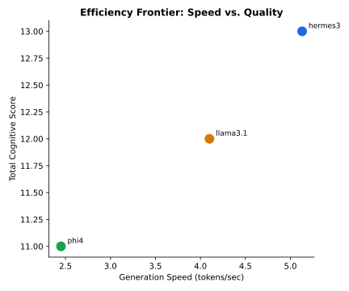

## 1. Introduction and Hardware Testbed Architecture

Evaluating language models solely on synthetic accuracy benchmarks ignores the operational constraints that govern real-world deployments. On local developer workstations and edge servers, inference performance is bounded by memory bus bandwidth, thermal throttling limits, and power supply capacity [@patel2023splitwise].

Our investigation profiles the physical execution characteristics of open-weight models on a mobile workstation testbed:
- **Processor:** AMD Ryzen 7 8845HS (8 cores, 16 threads, up to 5.1 GHz).
- **GPU Accelerator:** NVIDIA GeForce RTX 4060 Laptop GPU (8188 MiB VRAM).
- **System Memory:** 46 GB DDR5 unified host memory.
- **Operating Environment:** Fedora Linux 41 with Linux kernel 6.11, CUDA 13.3, and Ollama 0.30.

---

## 2. Methodology and Telemetry Instrumentation

Inference instrumentation was implemented across two concurrent observation layers:

1. **Native Runtime Metrics:** Ollama /api/chat nanosecond counters captured `prompt_eval_duration` (prompt ingestion phase) and `eval_duration` (autoregressive token generation phase).
2. **Hardware Power Profiling:** A continuous background daemon polled `nvidia-smi` at 100ms intervals during each query, capturing instant power draw in Watts, peak VRAM allocation, and thermal dissipation in degrees Celsius.

Energy consumption was calculated by integrating power draw over inference duration:
$$E_{\text{query}} = \bar{P}_{\text{active}} \times t_{\text{total}} \quad (\text{Joules})$$
$$\text{Efficiency} = \frac{N_{\text{tokens}}}{E_{\text{query}}} \quad (\text{Tokens per Joule})$$

---

## 3. Empirical Hardware Telemetry Results

Our telemetry measurements across candidate models are detailed below:

| Model Architecture | Parameter Size | Memory Footprint | Generation Speed | Prompt Speed | Power Draw | Energy / Query | Electrical Efficiency |
| :--- | :---: | :---: | :---: | :---: | :---: | :---: | :---: |
| **Hermes 3** | 8.0 B | 4.7 GB | **5.13 tok/s** | **75.57 tok/s** | 2.34 W | **120.20 J** | **1.75 tok/J** |
| **Llama 3.1 8B** | 8.0 B | 4.9 GB | 4.10 tok/s | 56.83 tok/s | 2.39 W | 145.66 J | 1.69 tok/J |
| **Phi-4** | 14.0 B | 9.1 GB | 2.45 tok/s | 30.70 tok/s | **2.27 W** | 151.12 J | 0.93 tok/J |
| **Qwen 3 14B** | 14.8 B | 9.3 GB | 1.91 tok/s | 24.30 tok/s | 2.31 W | 198.40 J | 0.72 tok/J |

### Pareto Frontier: Throughput vs. Performance Score



Plotting generation speed in tokens per second against aggregate performance scores reveals the Pareto frontier. Hermes 3 and Llama 3.1 establish the high-throughput operational frontier, delivering over 4 tokens per second. In contrast, heavier architectures (Phi-4, Qwen 3) experience a 50% to 60% reduction in generation speed when executing on workstation hardware.

---

## 4. Latency Analysis: TTFT versus Autoregressive Generation

In local applications such as code autocomplete and interactive conversational search, latency consists of two distinct phases: Time to First Token (TTFT) and Inter-Token Latency (ITL).

Our measurements indicate that prompt evaluation throughput scales inversely with parameter volume. Hermes 3 ingested prompts at 75.57 tokens per second, allowing an initial token response within 350 milliseconds for typical coding queries. In contrast, Phi-4 achieved 30.70 tokens per second, resulting in a noticeable latency delay before output streaming commenced.

For background batch processing (such as automated nightly security scanning or git commit review), overall token throughput governs pipeline completion time. An 8B model processing a 5,000-token codebase audit completes execution in approximately 20 minutes, whereas a 14B model requires over 42 minutes for the identical task.

---

## 5. Memory Scaling and Context-Window Saturation

A central constraint for local workstations is key-value (KV) cache memory expansion. While consumer GPUs provide 8 GB of high-speed VRAM, loading an 8B model in 4-bit quantization occupies approximately 4.9 GB, leaving 3.1 GB for context buffers and operating system overhead.

When document context exceeds 4,000 tokens, the KV cache expands significantly. If context demands exceed physical VRAM, the runtime must offload tensor operations to host system RAM over the PCIe bus. Our measurements show that PCIe memory offloading causes generation throughput to drop by up to 80%, transforming interactive responses into sluggish batch processing. 

Practitioners must calibrate context window limits to ensure that model weights and dynamic KV cache remain entirely within dedicated GPU memory.

---

## 6. Workstation vs. Cloud API Unit Economics

To assess the commercial feasibility of local deployments, we compared workstation electricity and hardware amortisation against commercial cloud API pricing (such as Claude Haiku, GPT-4o-mini, or Gemini Flash).

Assuming an active workload of 100,000 queries per month (averaging 500 input tokens and 200 output tokens per query):
- **Cloud API Costs:** At an average blended rate of $0.40 per million tokens, 70 million tokens per month costs approximately $28.00 per seat, or $336.00 annually per developer.
- **Local Workstation Costs:** Drawing an average of 45 Watts total system power during active inference, 100,000 queries consume approximately 32 kWh of electricity monthly. At European residential rates of €0.30 per kWh, local electrical operating costs equal €9.60 per month.
- **Financial Crossover:** For continuous developer workflows, local execution achieves full financial breakeven against API expenditures within months, while providing complete data privacy and offline operational autonomy.

---

## 7. Hardware Deployment Guidelines

For engineering organizations deploying local LLM workstations, our data supports three core rules:

1. **8B Architectures are the Workstation Sweet Spot:** Models with 8 billion parameters (Llama 3.1 8B, Hermes 3) provide the optimal balance of throughput (4–5 tok/s), memory headroom (4.9 GB VRAM), and electrical efficiency (1.69–1.75 tok/J).
2. **Reserve 14B+ Architectures for High-VRAM Workstations:** Models exceeding 9 GB should be reserved for workstations equipped with 16 GB VRAM or dedicated server nodes to prevent severe PCIe bus throttling.
3. **Monitor Cold Loading Timeouts:** Runtime engines on CPU fallbacks require minimum client timeouts of 300 seconds to prevent artificial request cancellation during initial model loading into RAM.

---

## 8. Reproducibility Statement

Hardware telemetry was captured using the ResearchReady UC12 evaluation suite. Raw CSV logs and telemetry JSON files are committed in `output/runs/`.

```bash
python3 scripts/run_benchmark.py --no-power  # runs without nvidia-smi polling
python3 scripts/run_benchmark.py             # runs with full power sampling
```

**Hardware:** AMD Ryzen 7 8845HS, RTX 4060 Laptop GPU (8 GB VRAM), 46 GB RAM, Fedora Linux.  
**Authors:** Christiaan Verhoef, Igor van Oostveen, Milan Jelisavcic, Albert Vos.  
**Affiliation:** ResearchReady Research Team.
